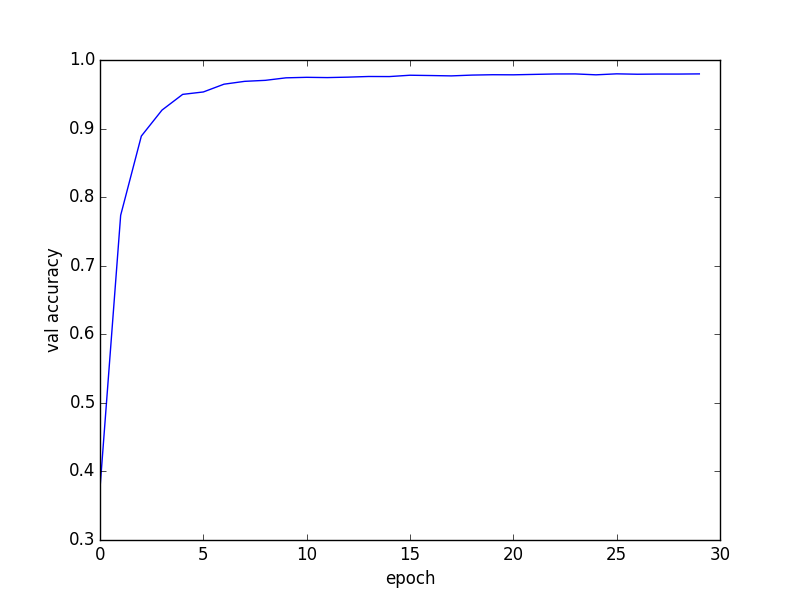

DeepID
===
Paper: [Deep Learning Face Representation from Predicting 10,000 Classes](http://mmlab.ie.cuhk.edu.hk/pdf/YiSun_CVPR14.pdf)

Year: 2014

DeepID refers to Deep hidden Identity, which actually is a **160**-dim hidden layer output before softmax layer. The author used multi-patch, including multiple regions, multiple scales, color and grey face images, to do multi-class face identification. The trained network is used to extract face feature. **97.45%** verification accuracy is achieved on LFW, with only weakly aligned faces.

#### Deep ConvNets

- The input is 39 x 31 x k for rectangle patches and 31 x 31 x k for square patches, where k = 3 for color patches and k = 1 for grey patches.
- The network contains 4 conv layers. The third conv layer and fourth conv layer are connected as DeepID layer. Thus, DeepID can see multi-scale features. There are two pros:
    - Four conv layer is more global than third conv layer. Face image is small and has many details, multi-scale feature leads to more abundant information.
    - The neurons in fourth conv layer is few and will become bottleneck for information probation.
- The model are trained based on 60 ConvNets, which 60 = 10 (regions) x 3 (scales) x 2 (color and grey). Total length of DeepID is 19,200 = 160 x 60 x 2 (horizontally flipped counterpart), which is used for face verification.

#### Face verification

- Joint Bayesian is better than neural network in verification accuracy.

#### Misc notes
- For face verification, the performance of multi-scale ConvNets is better than conventional ConvNets (without skipping layer).
- More face identities, more face verification accuracy. Concretely, more face identity classes for identification is more challengeable, but result in better representations if well trained.
- The verification accuracy is **97.45%**. Some details:
    - DeepID feature vector: 32,000-dim = 100 (patches) x 2 (face pair) x 160
    - Trained on CelebFaces+ and do [transfer learning](http://www.cv-foundation.org/openaccess/content_iccv_2013/papers/Cao_A_Practical_Transfer_2013_ICCV_paper.pdf) on LFW
    - Employ Joint Bayesian to do face verification
    - CelebFaces+: random 8700 people for training, and 1477 for face verification
    - ten-fold cross validation on LFW

#### Experiment (by ctliu3)

I've try DeepID on Youtube Face DB, the validation accuracy can be seen in the following plot.
I trained this with batch normalization, if not, the model seems can not converge.

Detailed settings:
- The are 1595 classes, images are shuffled, 20 for training and 5 for validation
- Learning rate: 0.05, drop in each epoch (x0.9)
- batch size: 512

